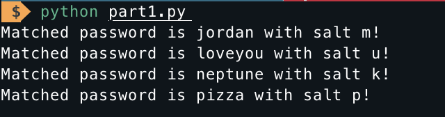
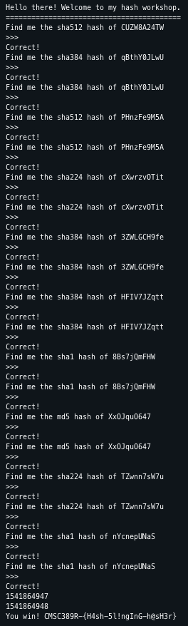

Writeup 9 - Crypto I
=====

Name: Luke Mann
Section: 0201

I pledge on my honor that I have not given or received any unauthorized assistance on this assignment or examination.

Digital acknowledgement of honor pledge: Luke Mann

## Assignment 9 Writeup

### Part 1 (60 Pts)
This first part was fairly straightforward. I looped through each of the provided passwords and then tested the hash of that password with each of the salts added. If the hash matched one of the hashes provided in the wordlist, I printed it out with the following result: 

The passwords are `jordan`, `loveyou`, `neptune`, and `pizza`. 
### Part 2 (40 Pts)
For this part, I made a repeating loop wherein I extracted the hash method and the string to be hashed from the received bytes. Then, after I noticed that the methods all matched the python function names, I used `getattr` to call the appropriate hashing function from `hashlib` and sent the hashed string back. After this repeated a few times, I got the flag `CMSC389R-{H4sh-5l!ngInG-h@sH3r}`!

Screenshot:
